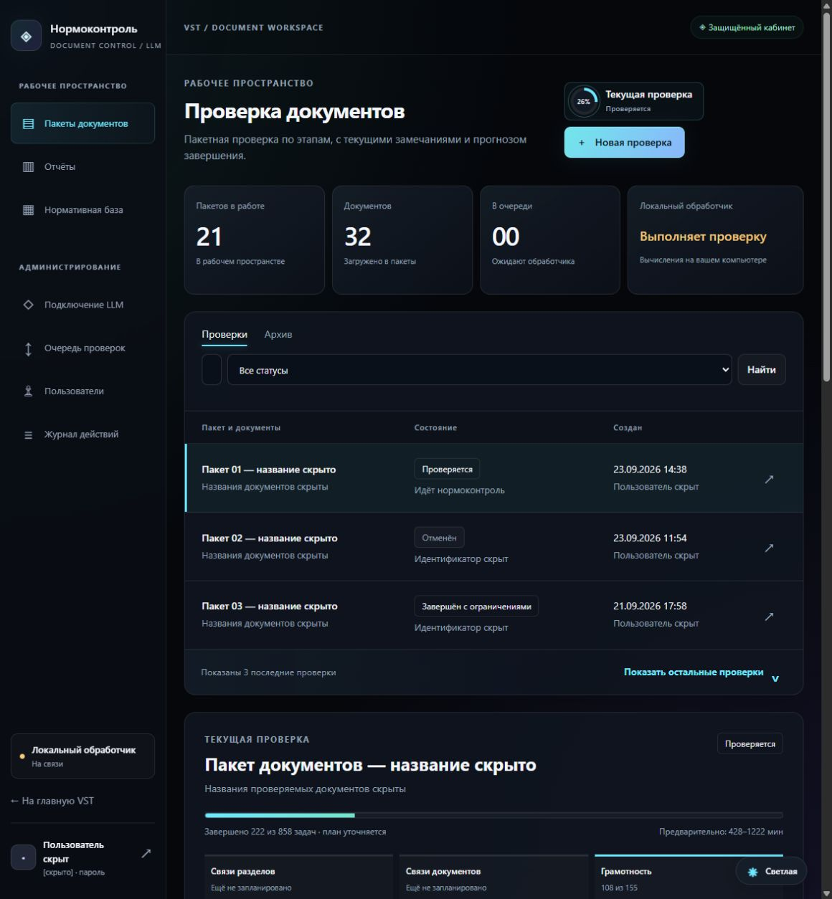
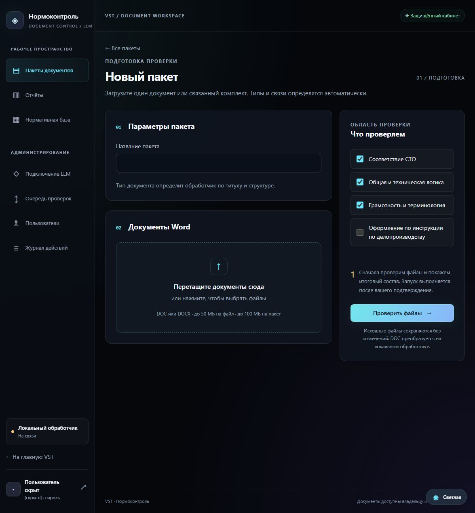
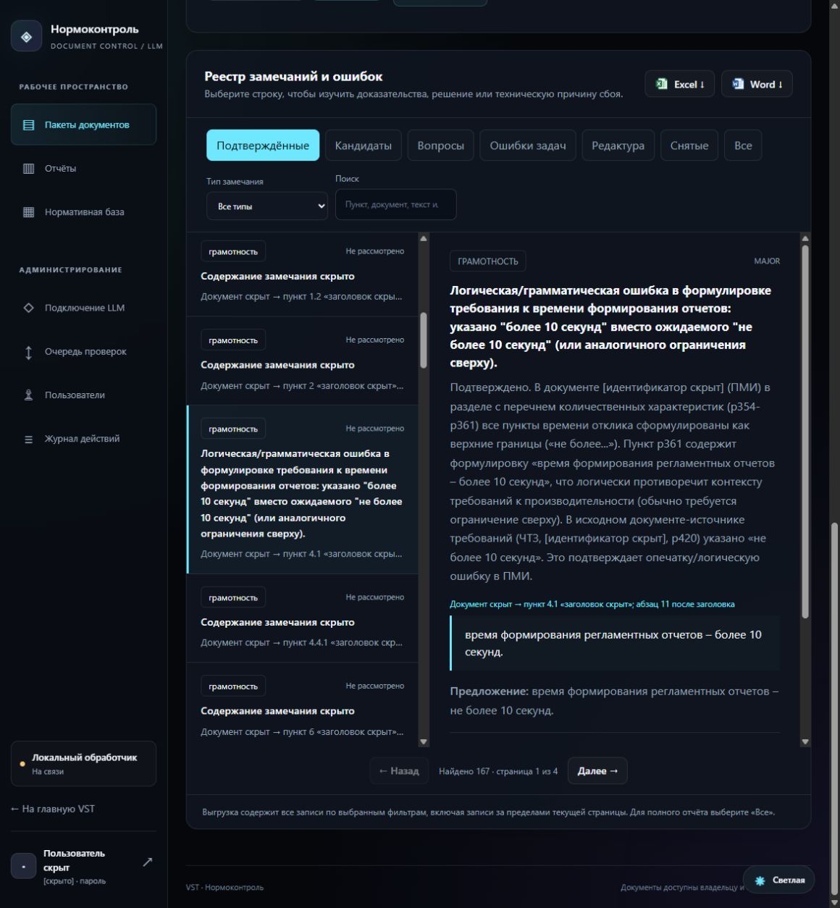

# Нормоконтроль

**Портал совместной работы над технической и проектной документацией: доверенная LLM, нормативная база и опыт рецензентов.**

Нормоконтроль объединяет проектную команду вокруг комплекта документов и общего процесса проверки: от загрузки и анализа до разбора замечаний и повторного контроля. Команда выбирает доверенную языковую модель, формирует нормативную базу и накапливает проверенный опыт рецензирования для последующих проверок.

Проект предназначен для специалистов по нормоконтролю, технических писателей, аналитиков и проектных команд, работающих с ТЗ, ЧТЗ, ОИТ и другой технической и проектной документацией.

[Установка на Windows](INSTALL-WINDOWS.md) · [Установка на Linux](INSTALL-LINUX.md) · [Выбор варианта установки](INSTALL.md) · [Как проверяются требования](docs/NORMATIVE-CONTROL.md) · [Отдельный vision-этап](docs/vision-stage.md)

## Три основы системы

### 1. Портал для совместной работы проектной команды

Комплект документов, проверки, замечания и решения специалистов находятся в одном рабочем пространстве. Команда видит ход обработки, разбирает доказательства, фиксирует решения и запускает повторный контроль после изменений. Доступ к чужим проверкам регулируется правами пользователей.

Результат работы — реестр с обоснованиями, цитатами и адресами для исправления. Его можно изучать в портале или передать коллегам в Word и Excel. Единицей проверки может быть как отдельный документ, так и связанный комплект: система анализирует согласованность документов между собой.

### 2. Простое подключение и замена доверенной LLM

Модель подключается через OpenAI-совместимый API. Адрес сервера, модель и параметры контекста вынесены в настройки, поэтому смена совместимого сервера или модели не требует переработки портала и нормативной базы. Базовый вариант развёртывания — локальная модель через `llama.cpp`; доверенный сервер выбирает организация с учётом правил доступа к документам.

Для замены подключите выбранную модель, укажите параметры соединения и проверьте доступность API. Перед рабочим запуском проверьте совместимость структурированных ответов и качество на контрольных примерах: одинаковый API не гарантирует одинаковых результатов. Передача адреса модели из портала обработчику разрешается отдельно в конфигурации обработчика.

### 3. «Дообучение» через нормативную базу и рецензии пользователей

База знаний развивается из двух источников: **нормативных документов** — стандартов и инструкций, в том числе СТО РЖД — и **рецензий пользователей**, которые разбирают замечания и объясняют необходимые исправления.

Из нормативных документов формируется каталог требований с цитатами, условиями применимости и зависимостями. Рецензия проходит перепроверку по исходному документу; подтверждённое исправление с доказательствами сохраняется как пример для последующих проверок. Само изменение статуса замечания не превращается в новое правило.

Здесь «дообучение» означает обогащение контекста модели через RAG и проверенные примеры, **без изменения её весов**. Накопленные знания хранятся отдельно от LLM и сохраняются при её замене. Частное решение по одному документу не должно становиться универсальным нормативным требованием. В текущей реализации примеры рецензий подбираются в рамках владельца проверки и типа документа; они не распространяются автоматически на всех пользователей.



*Скриншоты действующего веб-портала. Пользователи, названия пакетов и документов обезличены; содержательные фрагменты скрыты. Показатели на снимках относятся к отдельной незавершённой проверке и не являются оценкой скорости или качества системы.*

## Что проверяет система

| Направление | Содержание проверки |
| --- | --- |
| Требования СТО | Структура и содержание документа, применимые обязанности, условия, исключения и зависимости нормативных пунктов |
| Грамотность | Орфография, грамматика, терминология и единообразие формулировок |
| Техническая логика | Противоречия в параметрах, требованиях, сценариях и описаниях взаимодействия |
| Связи разделов и документов | Согласованность описаний, числовых значений, ссылок и обязательств внутри документа и между документами комплекта |
| Оформление | Проверяемые параметры оформления по загруженной инструкции по делопроизводству; направление включается отдельно |

Стандарты не передаются модели целиком при каждом запросе: локальная база RAG подбирает требования и связанные нормативные фрагменты. Документы обрабатываются последовательными частями с учётом структуры и доступного контекста модели.

## Как проходит работа

1. **Создайте пакет.** Добавьте один или несколько связанных документов `.docx` или `.doc`, выберите направления проверки.
2. **Подтвердите запуск.** Проверьте состав пакета и отправьте его в очередь. Обработчик уточнит типы документов и извлечёт структуру.
3. **Следите за ходом проверки.** В рабочем пространстве отображаются этапы, прогресс, предварительный прогноз завершения и уже найденные замечания.
4. **Разберите результаты вместе с командой.** Откройте доказательства, отметьте решение специалиста или отправьте рецензию на перепроверку. Подтверждённые исправления пополнят базу проверенных примеров.
5. **Выгрузите отчёт.** Сохраните реестр в Word или Excel; также доступны JSON и Markdown.



### Замечание можно проверить и найти в документе

Карточка содержит описание проблемы, обоснование, цитату и предложение по исправлению. Для нормативного замечания указывается основание СТО. Адрес ведёт к пункту и абзацу после заголовка, а для таблиц — к строке и ячейке, если эти сведения удалось извлечь.

Реестр разделяет подтверждённые системой замечания, кандидатов, вопросы и ошибки выполнения задач. Доступны поиск и фильтры по типу замечания: СТО, грамотность, техническая логика и другие направления. Решение специалиста учитывается отдельно от результата автоматической проверки.



### Управление пакетами и доступом

- Очередь, пауза, отмена, повторная проверка и архив пакетов.
- Дополнение остановленного пакета документами с уведомлением о запуске проверки заново с начала.
- История с тремя последними проверками по умолчанию и раскрытием остальных.
- Светлая и тёмная темы, переход из счётчиков текущей проверки в реестр.
- Администрирование пользователей, сброс паролей и управление очередью.
- Просмотр чужих проверок — по отдельному разрешению администратора; назначение администраторов.
- Раздел «Нормативная база» с загруженными источниками и настройками RAG.
- Состояние локальной LLM, VRAM, загрузка GPU, скорости генерации и prefill с минутными графиками; администратор может запускать, останавливать и безопасно перезапускать модель.

## Развёртывание и хранение данных

Можно использовать локальный интерфейс на одном компьютере или отдельный веб-портал для совместной работы.

```text
Проектная команда → портал: комплекты, проверки, замечания, рецензии
                         ↕
             Локальный обработчик проверок
                ├── структура и факты документов
                ├── нормативная база RAG и проверенные примеры
                └── доверенная LLM через совместимый API
```

| Компонент | Назначение и данные |
| --- | --- |
| Веб-портал, Django | Хранит учётные записи, загруженные оригиналы документов, пакеты, очередь и результаты. Может размещаться на отдельном сервере |
| Локальный обработчик | Читает документы, выполняет проверки и хранит рабочее состояние, нормативную базу, проверенные примеры рецензий и результаты обработки |
| Сервер модели | Выполняет генерацию через OpenAI-совместимый API; при локальной конфигурации работает на компьютере обработчика |

**При использовании портала документы передаются на сервер портала.** Локальное выполнение LLM не означает, что все данные остаются только на компьютере пользователя. Для полностью локальной работы используйте локальный интерфейс и локальный адрес модели. Если указать внешний API модели, отправляемые на анализ фрагменты будут передаваться этому провайдеру.

Вычислительная нагрузка приходится на обработчик и модель. Порталу не требуется GPU. Доступ к порталу, его хранилищу и обмену с обработчиком нужно настроить по [инструкции развёртывания](INSTALL-LINUX.md).

## Установка

| Вариант | Для чего подходит | Особенности |
| --- | --- | --- |
| [Windows](INSTALL-WINDOWS.md) | Локальная работа или обработчик для удалённого портала | `.docx`; `.doc` и сверка автоматической нумерации через установленный Microsoft Word |
| [Linux](INSTALL-LINUX.md) | Портал на VPS или полная установка для `.docx` | Для `.doc` нужен Windows-обработчик либо предварительное преобразование в `.docx` |

Для обработчика нужны Python 3.11 или 3.12, доступ к совместимому API доверенной LLM и подготовленная нормативная база. Приведённые инструкции используют `llama.cpp` с GGUF-моделью. При размещении модели на своём оборудовании требования к RAM и VRAM зависят от модели, квантования, контекста и настроек запуска. Модель и тексты стандартов в репозиторий не входят.

### Первый локальный запуск на Windows

**1. Установите зависимости.**

```powershell
git clone https://github.com/vadimnstepanov-dot/normcontrol.git
cd normcontrol
powershell -ExecutionPolicy Bypass -File .\scripts\install-windows.ps1
```

Если Python не обнаружен, используйте параметр `-PythonExecutable`, как описано в [инструкции Windows](INSTALL-WINDOWS.md).

**2. Запустите модель.** Скопируйте [пример запуска llama.cpp](scripts/start-llama.example.bat), укажите пути к серверу и GGUF-модели, подберите параметры под оборудование. Адрес API должен совпадать с `endpoint` в созданном файле `sto_rag/data/nc5/config.json`; по умолчанию — `http://127.0.0.1:8082`. Значение `context` должно соответствовать доступному контексту сервера.

Проверьте доступность API:

```powershell
Invoke-RestMethod http://127.0.0.1:8082/v1/models
```

**3. Подготовьте нормативную базу.** Поместите разрешённые к использованию исходные СТО `.docx` в корень проекта. Для следующего шага сверки нужен установленный Microsoft Word.

```powershell
powershell -ExecutionPolicy Bypass -File .\sto_rag\verify_word.ps1
.\.venv\Scripts\python.exe .\sto_rag\rag.py build
$env:PYTHONPATH = "$PWD\sto_rag"
.\.venv\Scripts\python.exe .\sto_rag\normcontrol_v5.py catalog
.\.venv\Scripts\python.exe .\sto_rag\normcontrol_v5.py catalog-audit
```

Изучите ограничения аудита каталога до проверки документов. Происхождение цитат, полнота выделения обязанностей, применимость и нормативные зависимости оцениваются отдельно — подробнее в [описании нормативного контроля](docs/NORMATIVE-CONTROL.md).

**4. Проверьте соединение и откройте интерфейс.**

```powershell
.\.venv\Scripts\python.exe .\sto_rag\normcontrol_v5.py probe
.\.venv\Scripts\python.exe .\sto_rag\normcontrol_v5.py serve
```

Используйте адрес с одноразовым токеном, выведенный в консоль. Локальный интерфейс по умолчанию слушает `127.0.0.1:8096`.

Скриншоты выше показывают **отдельный Django-портал**, а не локальный интерфейс. Установка портала, создание администратора и подключение обработчика описаны в [инструкциях Windows](INSTALL-WINDOWS.md) и [Linux](INSTALL-LINUX.md).

## Как оценивать результат

Система помогает специалисту находить ошибки; автоматический отчёт не заменяет профессиональное решение о соответствии документа.

- **Нормативный охват и число нарушений — разные показатели.** Мало замечаний не означает, что все требования проверены.
- **Отсутствие должно быть доказано.** По отдельной поисковой выборке нельзя подтвердить, что информация отсутствует во всём документе.
- **Непроверенные области остаются видимыми.** Ошибки задач, недостаточные доказательства и неразрешённые нормативные ссылки должны учитываться при чтении отчёта.
- **Качество зависит от исходных данных.** Неполная база СТО, ошибки извлечения текста, сложные схемы и ограничения модели могут привести к пропускам или ложным замечаниям.
- **Прогноз времени предварительный.** Он уточняется по ходу работы; длительность зависит от размера комплекта, числа требований, модели и оборудования.

Статус «подтверждено» относится к процедуре проверки системы, а не к безошибочности вывода. Важные замечания следует сверять с документом и нормативным источником. Принципы проверки доказательств и ограничений описаны в [технической документации](docs/NORMATIVE-CONTROL.md).

## Документация и разработка

| Материал | Содержание |
| --- | --- |
| [INSTALL.md](INSTALL.md) | Выбор схемы установки |
| [INSTALL-WINDOWS.md](INSTALL-WINDOWS.md) | Модель, Word, локальный обработчик и запуск на Windows |
| [INSTALL-LINUX.md](INSTALL-LINUX.md) | Портал на VPS, полная установка для `.docx` и эксплуатация |
| [Нормативный контроль](docs/NORMATIVE-CONTROL.md) | Каталог требований, доказательства, применимость и проверка качества |
| [Пример конфигурации](config/config.example.json) | Адрес модели, контекст и параметры обработки |

Основной движок и локальный интерфейс находятся в `sto_rag/nc5`, веб-портал — в `normcontrol-web`, сценарии установки и запуска — в `scripts`.

### Командная строка

```powershell
$env:PYTHONPATH = "$PWD\sto_rag"

# Проверка связанного комплекта
.\.venv\Scripts\python.exe .\sto_rag\normcontrol_v5.py run `
  "C:\Documents\ТЗ.docx" "C:\Documents\ОИТ.docx"

# Состояние заданий
.\.venv\Scripts\python.exe .\sto_rag\normcontrol_v5.py status

# Продолжение задания и экспорт
.\.venv\Scripts\python.exe .\sto_rag\normcontrol_v5.py resume <job-id>
.\.venv\Scripts\python.exe .\sto_rag\normcontrol_v5.py export <job-id>
```

### Проверка изменений

Полный набор тестов движка использует подготовленный тестовый каталог. Сначала соберите его по инструкции либо подключите разрешённые тестовые нормативные источники.

```powershell
$env:PYTHONPATH = "$PWD\sto_rag"
.\.venv\Scripts\python.exe -m unittest discover -s .\sto_rag\nc5\tests

$env:APP_DEBUG = "1"
$env:APP_DATA = "$env:TEMP\normcontrol-web-tests"
.\.venv\Scripts\python.exe .\normcontrol-web\manage.py test portal
```

Сообщить о проблеме или предложить улучшение можно через [Issues](https://github.com/vadimnstepanov-dot/normcontrol/issues). Укажите версию проекта, этап проверки, ожидаемый и фактический результат. Для воспроизведения используйте обезличенный пример; не прикладывайте пароли, токены и рабочие документы с ограниченным доступом.

В репозитории не распространяются тексты СТО, пользовательские документы, рабочие отчёты, GGUF-модели и конфигурация конкретной инфраструктуры. Добавляйте нормативные источники только при наличии права их использования. Перед отправкой изменений проверяйте состав файлов: `.gitignore` не заменяет проверку содержимого.
