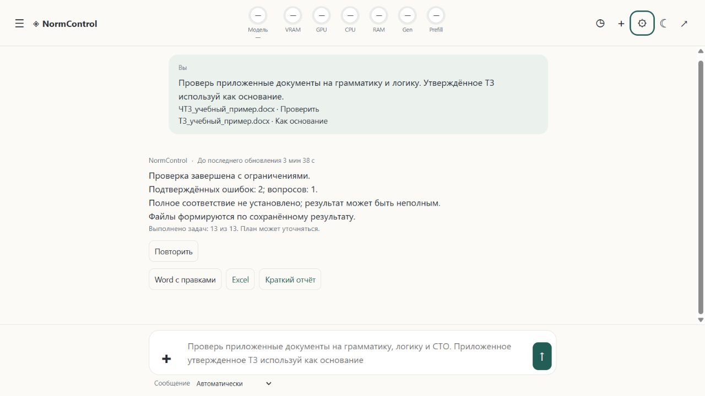
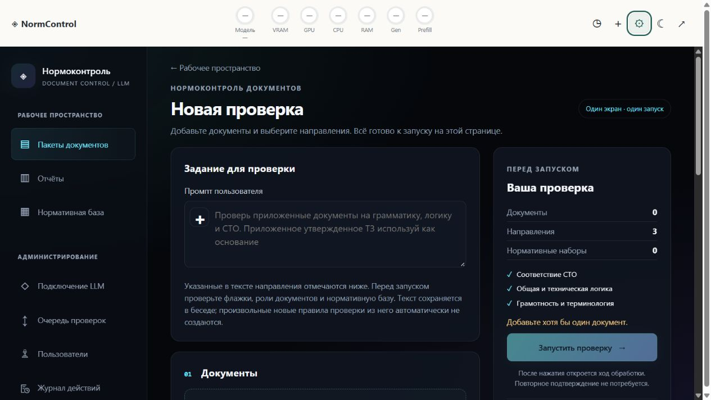
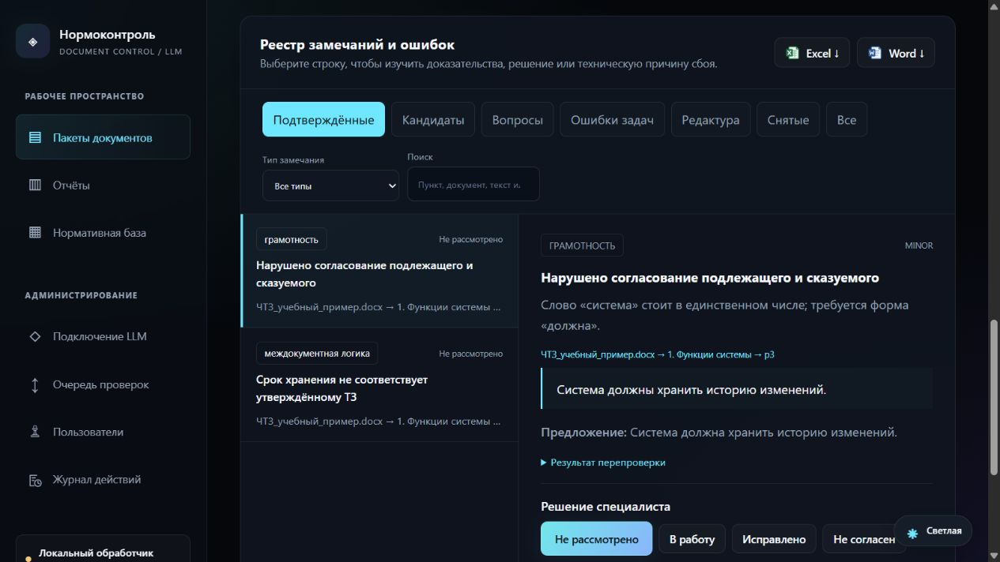
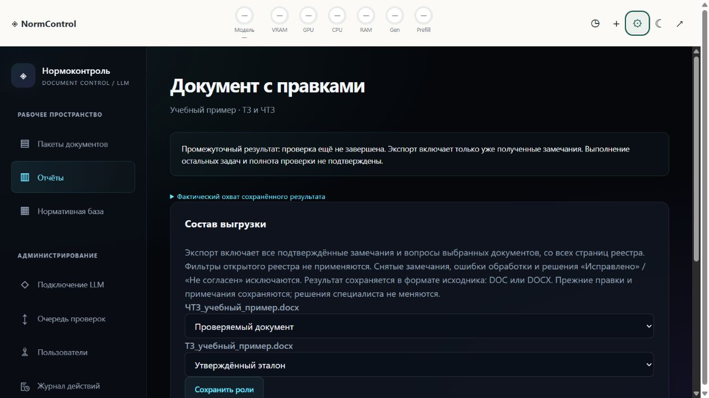

# NormControl — Нормоконтроль

**Версия 1.0.0** · [Описание выпуска](docs/RELEASE-1.0.0.md) · [История изменений](CHANGELOG.md) · [Установка](INSTALL.md)

**Проверка технической и проектной документации с доверенной языковой моделью, нормативной базой RAG и совместным разбором замечаний.**

NormControl помогает проверять ТЗ, ЧТЗ и связанные комплекты по СТО, грамматике и технической логике. Команда загружает документы, выбирает основания и направления проверки, получает замечания с цитатами и разбирает решения в общем реестре. Утверждённый ТЗ может служить основанием для проверки ЧТЗ, не получая собственных замечаний.

В 1.0.0 доступны свободный диалог с моделью и поиск по нормативной базе, чат и экспертный интерфейс, Word с настоящими правками и примечаниями, Excel, общий планировщик ресурсов и основной обработчик в WSL/Docker. Модель и Microsoft Word могут оставаться на Windows; порталу не нужна видеокарта.

[Windows](INSTALL-WINDOWS.md) · [Linux / VPS](INSTALL-LINUX.md) · [WSL / Docker](deploy/native-core/README.md) · [Нормативная база Knowledge v2](deploy/knowledge-v2/INSTALL.md) · [Правила проверки](docs/NORMATIVE-CONTROL.md)

## Интерфейс

Чат подходит для задания на обычном языке и вопросов к модели. Кнопка **«+»** прикрепляет документы; выбранные файлы показаны под полем. История, тема, режим и показатели модели находятся в одной верхней панели. Боковая панель в чате по умолчанию скрыта, у эксперта открыта. Рядом с NormControl отображается время ожидания или работы; счётчик восстанавливается после обновления страницы и останавливается на паузе или после завершения.



*Все снимки 1.0.0 сделаны на отдельном стенде с учебными документами и синтетическими результатами. Это примеры интерфейса, а не измерения скорости или качества. Модель и аппаратная телеметрия на стенде не подключены; индикаторы показывают «—».*

Экспертный режим сохраняет беседу и открывает форму с направлениями проверки, нормативной базой и параметрами. Известные направления из задания отмечаются в форме; перед запуском пользователь проверяет флажки и роли документов. Произвольный текст не превращается автоматически в новые правила проверки.



Если задание не введено, используется пример: **«Проверь приложенные документы на грамматику, логику и СТО. Приложенное утвержденное ТЗ используй как основание»**. Запуск нормативной проверки требует доступных опубликованных нормативов. Роли документов для запуска из чата задаются явно.

## Что проверяется

| Направление | Содержание |
| --- | --- |
| СТО | Применимые требования, структура, содержание, условия, исключения и связанные нормативные пункты |
| Грамотность | Орфография, грамматика, терминология и согласование формулировок |
| Техническая логика | Противоречия в параметрах, обязанностях и сценариях, согласованность разделов |
| Связи документов | Сопоставление целевого документа с утверждёнными основаниями и документами комплекта |
| Оформление | Проверяемые свойства документа по выбранным требованиям; включается отдельно |

Результаты разделены на подтверждённые замечания, кандидатов, вопросы, редакторские предложения и ошибки выполнения. Карточка содержит описание, цитату, адрес, основание и предложение по исправлению. Решение специалиста хранится отдельно от автоматического вердикта. Реестр поддерживает поиск, фильтры, перепроверку рецензий и выгрузку всех записей по выбранным фильтрам, включая остальные страницы.



## Диалог и знания RAG

Свободный вопрос направляется модели, а команда проверки создаёт обычный пакет через действующий механизм запуска. Диалог не заменяет проверки и их сохранённые планы. Для вопроса о нормативных требованиях подбираются доступные пользователю опубликованные источники Knowledge v2; ответ может содержать ссылки на использованные документы и пункты. Полный нормативный корпус не помещается в каждый запрос.

Нормативная база хранит редакции, цитаты, требования, условия применимости и связи. Предварительные кандидаты анализируются отдельно и не становятся подтверждёнными нормами автоматически. Для полноты конкретного норматива нужен отдельный аудит извлечения и применимости: [приёмка Knowledge v2](docs/KNOWLEDGE-V2-ACCEPTANCE.md).

Модель подключается через OpenAI-совместимый API, обычно локальный `llama.cpp`. Замена модели сохраняет базу знаний; совместимость структурированных ответов и качество проверяются отдельно. Проверенные рецензии могут обогащать RAG в рамках владельца и типа документа. Это обогащение контекста, **без изменения весов модели**.

## Word, Excel и отчёты

В разделе «Документ с правками» закрепляются роли: **проверяемый документ** и **утверждённый эталон**. Эталон участвует в обосновании связей и не получает правок или примечаний. Перед выгрузкой сохраняется план применения, связанный с точной редакцией исходника.

- Подтверждённая структурированная редакция применяется в режиме правок только при проверенном диапазоне и исходном тексте.
- Замечания и вопросы добавляются как примечания с разделом **«Основание»**. Свободный текст предложения не подставляется автоматически вместо документа.
- Исходный файл остаётся неизменным; прежние примечания и правки сохраняются. Неоднозначные диапазоны и ограничения отражаются в отчёте применения.
- **DOC → DOC** использует установленный Microsoft Word через Windows-мост. Основной конвейер читает XML-части Word в памяти без создания промежуточного DOCX. **DOCX → DOCX** работает с XML документа напрямую.
- Доступны полный реестр Excel, краткий отчёт, Word-реестр, JSON и Markdown. Промежуточная выгрузка явно обозначает непроверенные области.



Для DOC нужен настроенный Windows-мост и Word. В старом автономном Windows CLI остаётся конвейер с рабочей DOCX-копией; прямой DOC-конвейер включён в основной обработчик `native_core`. Чистый Linux без Windows-моста не обеспечивает точные правки DOC.

## Архитектура и ресурсы

| Компонент | Размещение и назначение |
| --- | --- |
| Django-портал | Аккаунты, пакеты, беседы, реестр, нормативные редакции и отчёты; Windows или Linux/VPS |
| Основной обработчик `native_core` | Подготовка, специализированные планировщики и выполнение проверок в Docker на WSL/Linux |
| Шлюз и общая очередь | TLS, зависимости, допуск CPU/GPU, контрольные точки и доступ к Windows-мосту |
| Knowledge v2 | Индекс, подбор требований, нормативные и документные обработчики в отдельных контейнерах |
| Windows-компоненты | GPU-модель, Microsoft Word, аппаратный мониторинг и удержание компьютера от сна |

Подготовка документов, управление зависимостями и очередь ресурсов объединены; правила каждого направления остаются специализированными. Две CPU-задачи могут выполняться одновременно с одной GPU-задачей при достаточной памяти. Стандартный резерв свободной RAM — **2048 МиБ**, верхний предел кэша документов — **1024 МиБ**; в контейнере кэш дополнительно ограничивается доступной памятью. Резерв допуска не равен лимиту памяти WSL.

SQLite и данные основного обработчика хранятся на Linux-диске WSL, не на `/mnt/c` и не на SMB. Комплект Compose ограничивает worker до 2 ГиБ, API до 768 МиБ, шлюз до 384 МиБ. Эти лимиты не включают модель и контейнеры Knowledge v2.

Повторный подсчёт токенов использует ограниченный постоянный кэш, привязанный к запросу и настройкам модели. Обрезанный ответ модели сохраняется для диагностики и не принимается как полный JSON-результат: применяются ограниченные повторные попытки и разбиение заданий. Это не гарантирует фиксированную длительность проверки большого документа.

Пауза, отмена и повторный запуск доступны в интерфейсе. Перед обновлением сервисов включается страница плановых работ со сроком и сохраняется контрольная точка. Автоматическое восстановление не отменяет более позднюю паузу пользователя.

## Установка и проверка выпуска

```sh
git clone --branch 1.0.0 https://github.com/vadimnstepanov-dot/normcontrol.git
cd normcontrol
```

Дальнейшие команды: [выбор схемы](INSTALL.md), [Windows](INSTALL-WINDOWS.md), [Linux](INSTALL-LINUX.md), [WSL/Docker из исходников](deploy/native-core/README.md). Примеры не содержат готовых ключей, моделей, нормативов или документов пользователей. Контейнерные образы собираются из исходников; наличие одноимённых образов в публичном реестре не предполагается.

Проверки в отдельном окружении Python 3.12 и Node.js 22:

```sh
python -m pip install -r requirements-test.txt -c requirements-test.lock
python -m pip check
python tools/test_release.py
node --test normcontrol-web/tests/chat_controls.test.cjs
```

Сценарий создаёт временную тестовую базу и использует синтетические нормативы. CI выполняет проверки на Windows и Ubuntu. Проверки выпуска не запускают рабочую модель и не доказывают полноту замечаний на конкретном комплекте.

## Практические ограничения

Отсутствие замечаний, пустой результат поиска или выполнение всех задач не доказывают раскрытие каждого требования. Невыполненный этап остаётся непроверенным; вопросы и кандидаты требуют решения специалиста. При проверке цепочки ТЗ → ЧТЗ → ПМИ условия и критерии испытаний можно проверять только при наличии самой ПМИ.

Word на Windows обязателен для прямого DOC и точного Word-экспорта. Защита документа, сложные поля, неоднозначные диапазоны и существующие правки могут ограничить автоматическое исправление. Изображения проверяются отдельным [vision-этапом](docs/vision-stage.md) при доступной совместимой модели; неподдерживаемые области сохраняются как ограничения.

Планы работающих проверок закреплены за версиями источников и обработчика. При обновлении нельзя подменять хэши старого плана: несовместимый запуск выполняется прежним обработчиком либо заменяется новой проверкой с сохранением старого результата.

## Разработка

- [Интерфейс чата](docs/CHAT-INTERFACE.md), [нормативная проверка](docs/KNOWLEDGE-V2-REVIEW.md), [измерения](docs/release-performance.md).
- Исходники портала: `normcontrol-web`; движок и RAG: `sto_rag`; контейнеры: `deploy`.
- Публичный URL-префикс `/normcontol/` сохранён для совместимости.
- Доступ к проверкам, документам, диалогу и экспортам ограничивается владельцем и правами администратора. Рабочие базы, журналы с цитатами, токены и закрытые нормативы не публикуются.